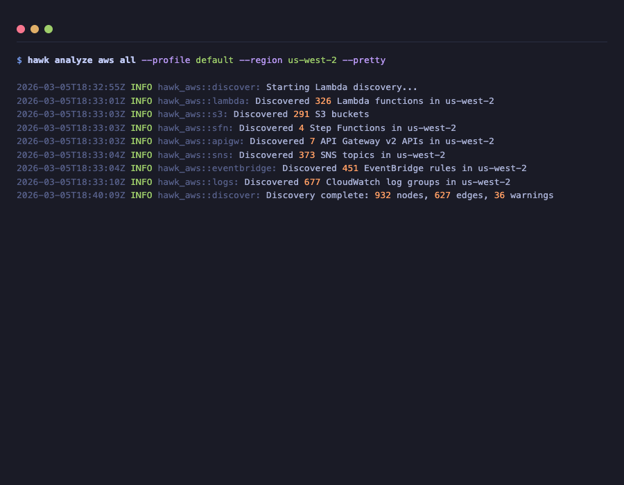
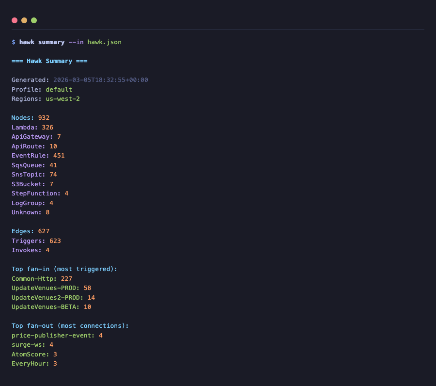
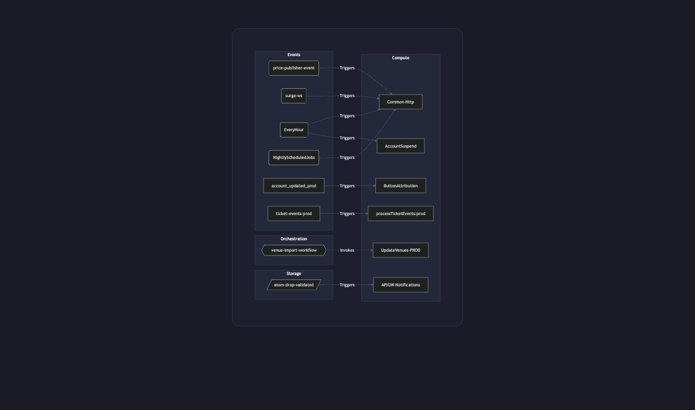

<p align="center">
  <h1 align="center">Hawk</h1>
  <p align="center">
    <strong>Map your AWS serverless architecture in seconds.</strong>
  </p>
  <p align="center">
    <a href="https://github.com/humancto/hawk/actions/workflows/ci.yml"></a>
    <a href="https://crates.io/crates/hawk-cloud"></a>
    <a href="https://github.com/humancto/hawk/blob/main/LICENSE"></a>
    <a href="https://github.com/humancto/hawk/releases"></a>
    
  </p>
  <p align="center">
    <a href="#quick-start">Quick Start</a> &middot;
    <a href="#cli-reference">CLI Reference</a> &middot;
    <a href="#interactive-viewer">Viewer</a> &middot;
    <a href="#aws-coverage">AWS Coverage</a> &middot;
    <a href="#contributing">Contributing</a>
  </p>
</p>

---

Hawk is a CLI tool and interactive viewer that automatically discovers AWS Lambda functions, their triggers, and connected services — then renders the entire architecture as a navigable graph.

Point it at an AWS account, get a complete picture of what triggers what.

<p align="center">
  
</p>

## Why Hawk?

- **You inherited an AWS account** and need to understand what's connected to what
- **You want to audit Lambda trigger chains** before making changes
- **You need a visual map** for architecture reviews or onboarding
- **You want to track infrastructure drift** by diffing snapshots over time

## Features

| Feature                  | Description                                            |
| ------------------------ | ------------------------------------------------------ |
| **Auto-discovery**       | Scans 7 AWS services for Lambda connectivity           |
| **Deterministic output** | Sorted, deduped JSON for stable diffs                  |
| **Mermaid export**       | Paste into GitHub, Notion, or any Markdown renderer    |
| **Snapshot diffing**     | Compare two scans to see what changed                  |
| **Interactive viewer**   | Bevy 2D app with search, filters, and layer toggles    |
| **Security-conscious**   | Env var values, secrets, and tokens are never exported |

---

## Quick Start

### Prerequisites

- **Rust 1.75+** — [install via rustup](https://rustup.rs)
- **AWS credentials** — configured via `~/.aws/credentials`, environment variables, or SSO
- **AWS permissions** — read-only access ([see IAM policy](#iam-policy))

### Install from source

```bash
git clone https://github.com/humancto/hawk.git
cd hawk
cargo install --path crates/hawk-cloud
```

### Install from crates.io

```bash
cargo install hawk-cloud
```

### Run Your First Scan

```bash
# Discover everything Hawk supports
hawk analyze aws all \
  --profile my-aws-profile \
  --region us-east-1 \
  --out hawk.json \
  --pretty

# Or just Lambda + event source mappings (faster)
hawk analyze aws lambda \
  --profile my-aws-profile \
  --region us-east-1 \
  --out hawk.json
```

### Explore the Output

```bash
# Print a summary to the terminal
hawk summary --in hawk.json

# Export as a Mermaid diagram
hawk export mermaid --in hawk.json --out hawk.mmd

# Include all node types (not just Lambda-centric)
hawk export mermaid --in hawk.json --out hawk.mmd --full

# Compare two snapshots
hawk diff --old baseline.json --new current.json
```

### Launch the Interactive Viewer

```bash
cargo run --release -p hawk_viewer -- hawk.json
```

---

## CLI Reference

### `hawk analyze aws <scope>`

Discover AWS resources and write a graph JSON file.

| Scope    | Description                                   |
| -------- | --------------------------------------------- |
| `lambda` | Lambda functions + event source mappings only |
| `all`    | All supported AWS services                    |

**Flags:**

| Flag               | Default     | Description          |
| ------------------ | ----------- | -------------------- |
| `--profile <name>` | env default | AWS profile name     |
| `--region <name>`  | env default | AWS region           |
| `--out <file>`     | `hawk.json` | Output file path     |
| `--pretty`         | off         | Pretty-print JSON    |
| `--verbose`        | off         | Enable debug logging |

### `hawk summary`

Print human-readable stats from a scan.

<p align="center">
  
</p>

<details>
<summary>Example output</summary>

```
=== Hawk Summary ===

Generated: 2026-03-05T14:30:00Z
Profile:   production
Regions:   us-east-1

Nodes: 47
  Lambda: 23
  SqsQueue: 8
  EventRule: 6
  S3Bucket: 4
  SnsTopic: 3
  StepFunction: 2
  ApiGateway: 1

Edges: 38
  Triggers: 31
  Invokes: 7

Top fan-in (most triggered):
  order-processor: 5
  notification-handler: 4

Top fan-out (most connections):
  main-event-bus: 6
```

</details>

### `hawk export mermaid`

Generate a Mermaid flowchart diagram.

| Flag           | Default     | Description         |
| -------------- | ----------- | ------------------- |
| `--in <file>`  | `hawk.json` | Input graph file    |
| `--out <file>` | `hawk.mmd`  | Output Mermaid file |
| `--full`       | off         | Show all node types |

Output works with GitHub Markdown, Notion, or the [Mermaid CLI](https://github.com/mermaid-js/mermaid-cli).

<p align="center">
  
</p>

### `hawk diff`

Compare two graph snapshots.

```bash
hawk diff --old monday.json --new friday.json
```

```
=== Graph Diff ===

Added nodes (2):
  + arn:aws:lambda:us-east-1:123:function:new-handler
  + arn:aws:sqs:us-east-1:123:new-queue

Removed nodes (1):
  - arn:aws:lambda:us-east-1:123:function:deprecated-fn

Added edges (2):
  + new-queue --Triggers--> new-handler
  + main-bus --Triggers--> new-handler
```

---

## AWS Coverage

| Source                       | Target | Edge Kind | Discovery Method                          |
| ---------------------------- | ------ | --------- | ----------------------------------------- |
| **SQS / DynamoDB / Kinesis** | Lambda | Triggers  | `ListEventSourceMappings`                 |
| **EventBridge rules**        | Lambda | Triggers  | `ListRules` + `ListTargetsByRule`         |
| **S3 notifications**         | Lambda | Triggers  | `GetBucketNotificationConfiguration`      |
| **SNS subscriptions**        | Lambda | Triggers  | `ListSubscriptionsByTopic`                |
| **CloudWatch Logs**          | Lambda | Triggers  | `DescribeSubscriptionFilters`             |
| **Step Functions**           | Lambda | Invokes   | `DescribeStateMachine` (definition parse) |
| **API Gateway v2**           | Lambda | Triggers  | `GetRoutes` + `GetIntegrations`           |

---

## Graph Schema

Output JSON follows a stable, documented schema:

```jsonc
{
  "generated_at": "2026-03-05T14:30:00Z",
  "profile": "production",
  "regions": ["us-east-1"],
  "nodes": [
    {
      "id": "arn:aws:lambda:us-east-1:123456789012:function:my-fn",
      "kind": "Lambda",
      "name": "my-fn",
      "arn": "arn:aws:lambda:us-east-1:123456789012:function:my-fn",
      "region": "us-east-1",
      "account_id": "123456789012",
      "props": {
        "runtime": "nodejs20.x",
        "memory_size": 256,
        "timeout": 30,
        "handler": "index.handler",
        "env_keys": ["DATABASE_URL", "API_KEY"], // values redacted
      },
    },
  ],
  "edges": [
    {
      "from": "arn:aws:sqs:us-east-1:123456789012:my-queue",
      "to": "arn:aws:lambda:us-east-1:123456789012:function:my-fn",
      "kind": "Triggers",
      "props": { "batch_size": 10 },
    },
  ],
  "warnings": [],
  "stats": { "node_count": 2, "edge_count": 1 },
}
```

**Node kinds:** `Lambda` `ApiGateway` `ApiRoute` `EventRule` `SqsQueue` `SnsTopic` `S3Bucket` `DynamoStream` `StepFunction` `LogGroup` `EcsService` `Ec2Instance` `LoadBalancer` `Unknown`

**Edge kinds:** `Triggers` `Invokes` `Consumes` `Publishes` `ReadsFrom` `WritesTo`

---

## Interactive Viewer

The Bevy-based viewer renders the graph as a 2D node-and-edge map.

| Action      | Input        |
| ----------- | ------------ |
| Select node | Click        |
| Pan         | Drag         |
| Zoom        | Scroll wheel |

**UI panels:**

- **Left panel** — search bar, layer toggles (Compute / Events / Storage / Orchestration)
- **Right panel** — selected node details (name, kind, ARN, region, properties)

| Layer         | Node Kinds                                                                |
| ------------- | ------------------------------------------------------------------------- |
| Compute       | Lambda, ECS Service, EC2 Instance                                         |
| Events        | EventBridge Rule, API Gateway, API Route, SNS Topic, SQS Queue, Log Group |
| Storage       | S3 Bucket, DynamoDB Stream                                                |
| Orchestration | Step Function                                                             |

---

## IAM Policy

Hawk requires **read-only** access. Minimal policy:

<details>
<summary>Click to expand IAM policy JSON</summary>

```json
{
  "Version": "2012-10-17",
  "Statement": [
    {
      "Sid": "HawkReadOnly",
      "Effect": "Allow",
      "Action": [
        "lambda:ListFunctions",
        "lambda:ListEventSourceMappings",
        "events:ListRules",
        "events:ListTargetsByRule",
        "s3:ListAllMyBuckets",
        "s3:GetBucketNotificationConfiguration",
        "sns:ListTopics",
        "sns:ListSubscriptionsByTopic",
        "logs:DescribeLogGroups",
        "logs:DescribeSubscriptionFilters",
        "states:ListStateMachines",
        "states:DescribeStateMachine",
        "apigateway:GET"
      ],
      "Resource": "*"
    }
  ]
}
```

</details>

---

## Security & Data Safety

Hawk is designed to be safe to run against production accounts:

- Environment variable **values are never exported** — only keys are recorded
- Secrets, tokens, and auth data are **redacted** from all output
- **No write operations** — Hawk only calls read/list/describe APIs
- **No data leaves your machine** — output is written to local files only
- Inline policy documents are excluded unless explicitly requested

---

## Project Structure

```
hawk/
├── Cargo.toml                  # Workspace root
├── crates/
│   ├── hawk_core/              # Graph model, stats, dedupe, redaction
│   ├── hawk_aws/               # AWS SDK discovery modules (7 connectors)
│   ├── hawk-cloud/               # CLI binary (clap-based)
│   └── hawk_render/            # Mermaid renderer
├── apps/
│   └── hawk_viewer/            # Bevy 2D interactive viewer
└── examples/
    └── sample_graph.json       # Example output for testing
```

---

## Development

```bash
cargo check --workspace            # Check compilation
cargo test --workspace             # Run all tests
cargo clippy --workspace           # Run clippy
cargo fmt --all                    # Format code
```

Unit tests don't require AWS credentials — they test ARN parsing, graph operations, Mermaid rendering, and data redaction. Integration tests use fixture JSON files in `examples/`.

---

## Roadmap

- [ ] API Gateway v1 (REST APIs) discovery
- [ ] Multi-region scanning in a single run
- [ ] Multi-account scanning (AWS Organizations)
- [ ] Force-directed graph layout in the viewer
- [ ] HTML export with interactive SVG
- [ ] Cost annotations via Cost Explorer API
- [ ] CloudFormation / CDK stack grouping
- [ ] Terraform state file import

---

## Contributing

See [CONTRIBUTING.md](CONTRIBUTING.md) for development setup, coding standards, and pull request guidelines.

## License

[MIT](LICENSE) — HumanCTO
